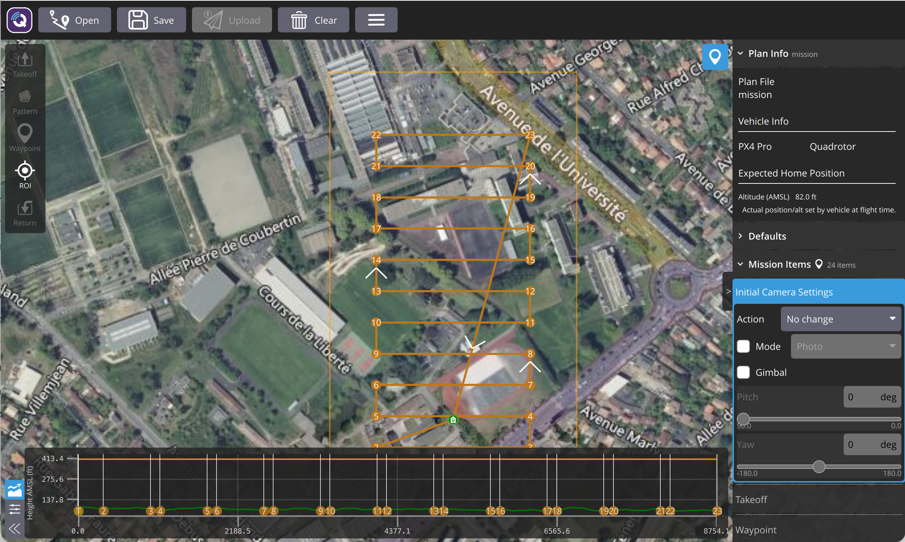
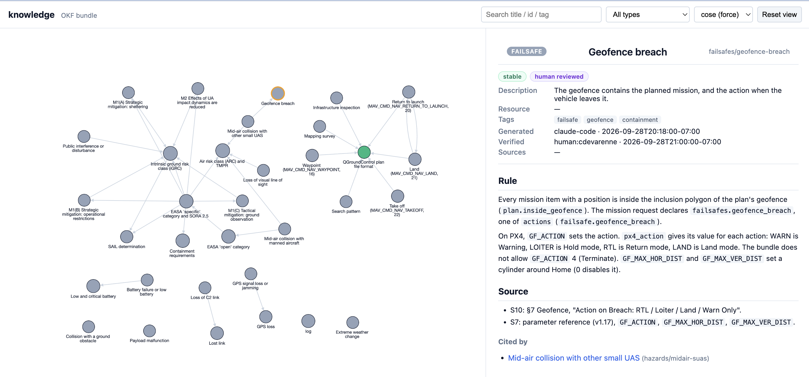

# okf-drone-skill

An Open Knowledge Format (OKF) bundle grounds an agent skill. The skill plans one civil drone
mission, validates the plan against the bundle, scores the risk with EASA SORA 2.5, and writes a
go / no-go report for a human to sign.

The same pattern as [okf-grc-skill](https://github.com/cdevarenne/okf-grc-skill), in a new domain:
a knowledge-grounded agent finds the rules, makes an artifact, validates it against the rules,
scores the risk, and writes a document that a person signs.

**Scope:** mission planning, safety and regulatory compliance for civil operations in the EU.
No flight controller, no live NOTAM or weather feeds in v1.

## Status

| Phase | Content | State |
|---|---|---|
| 0 | Scaffold, pinned versions, `.plan` subset schema, source register | Done |
| 1 | OKF bundle: regulations, SORA 2.5 tables, hazards, failsafes, MAVLink, mission types | Done, verified by the owner |
| 2 | `gen_plan`: mission request to QGroundControl `.plan` | Done |
| 3 | `validate_plan`, `score_risk` | Done |
| 4 | `render_report`, `signoff.yaml`, the seeded missions m01 to m05 | Done, reviewed by the owner |
| 5 | Screenshots, examples, "How this was built" | Done |
| DRN-10 | Optional PX4 SITL flight check (`make px4`, `make sitl`) | Done, flown by the owner |
| DRN-11 | Review fixes: `SKILL.md`, geofence legs, re-verification of a changed concept, ARC flag against the altitude | Done; changed concepts verified, m01 flown again by the owner |

The spec is [`docs/specs/2026-09-28-okf-drone-skill-v1-design.md`](docs/specs/2026-09-28-okf-drone-skill-v1-design.md).

## How it works

```
missions/<id>.yaml -> gen_plan -> validate_plan -> score_risk -> render_report
                        |             |               |              |
                   mission.plan  validation.json   risk.json   report.md, signoff.yaml
```

`make plan MISSION=missions/<id>.yaml` runs the pipeline. It calls no LLM.

- **GO:** all checks pass and there is no gap.
- **NO-GO:** at least one check fails.
- **HOLD:** no check fails, but at least one check or score has no concept (a coverage gap).
  A person must add knowledge or decide.

The tool writes `signoff.yaml` with empty approval fields. It never fills them.

### Optional: fly the plan in PX4 SITL (DRN-10)

`make sitl MISSION=missions/<id>.yaml` (after `make plan`) flies `mission.plan` in PX4
software-in-the-loop: the SIH quadrotor, headless, at the mission home. It sets the declared
failsafe actions from the `px4_action` values in the bundle, uploads the geofence and the
mission, and checks the flown track against the same concepts: the height limit, the geofence,
the return, and the failsafe parameters that PX4 reads back. It writes `sitl.json`,
`sitl_track.json` and the PX4 logs in `out/<id>/`. The flight is evidence for the person who
signs; it is not an approval and does not change the proposed decision. See
[`docs/specs/2026-09-28-drn-10-px4-sitl.md`](docs/specs/2026-09-28-drn-10-px4-sitl.md).

## How grounding works

- Every check and every score cites a concept id in `knowledge/`. A check id is on exactly one
  concept (`checks:` in the frontmatter); the loader rejects a duplicate.
- Code reads regulatory values only from a concept's `table:`. There is no threshold in code.
- A check with no concept is a gap. It is never a default value. For example, the SORA
  operational safety objectives (OSOs) are not in v1, so a 'specific' category mission is HOLD.
- Every concept has a `# Source` section. It cites only documents with status `read` in
  [`docs/sources.md`](docs/sources.md). The conformance test enforces this.
- Every concept has a `verified` entry from a person, at or after its last change
  (`generated.at`). The conformance test enforces this too.
- A concept counts only if a person verified it after its last change. An unverified concept,
  or a concept changed after its verification, is a gap.

## Seeded missions

Five missions in [`missions/`](missions/) test the decision rule (spec §7):

- m01: an open-category VLOS survey within all limits.
- m02: an inspection above the open-category height limit.
- m03: a search with a waypoint outside the declared geofence.
- m04: a survey with no lost-link failsafe action.
- m05: a specific-category BVLOS survey; the SORA OSO table is not in the bundle.

`make seeded` runs them and writes the decisions, the failed checks, the gaps and the cited
concepts to [`docs/data/seeded.json`](docs/data/seeded.json). The golden test fails if that file
is not current.

## Examples

[`examples/`](examples/) has the five output files of each seeded mission, as `make examples`
writes them: `mission.plan`, `validation.json`, `risk.json`, `report.md` and `signoff.yaml`
(with empty approval fields). Start with
[`examples/m02-altitude-over-limit/report.md`](examples/m02-altitude-over-limit/report.md).
A test fails if `examples/` is not the current output.



*The m01 plan (`examples/m01-survey-open/mission.plan`) in QGroundControl: takeoff at home,
the grid inside the area, return to launch, and the inclusion geofence. The coordinates are
arbitrary test values. The population density is declared, not looked up, so the GO applies to
the declared inputs only.*

## Knowledge bundle

| Folder | Content | Sources |
|---|---|---|
| [`regulations/`](knowledge/regulations/) | The 'open' category limits; the 'specific' category and SORA 2.5 | Reg. (EU) 2019/947; EASA AMC1 Art. 11 |
| [`risk/`](knowledge/risk/) | iGRC, ARC and TMPR, SAIL, containment; mitigations M1(A), M1(B), M1(C), M2 | EASA AMC1 Art. 11 (SORA 2.5); JARUS SORA 2.5 |
| [`hazards/`](knowledge/hazards/) | The flight-plan risk matrix: likelihood, severity, mitigation | Flight-plan template |
| [`failsafes/`](knowledge/failsafes/) | Lost link, battery, geofence, GPS loss: actions and PX4 parameters | Flight-plan template; PX4 v1.17 |
| [`mavlink/`](knowledge/mavlink/) | Takeoff, waypoint, return to launch, land | MAVLink common message set |
| [`mission-types/`](knowledge/mission-types/) | Grid, corridor, expanding square | Flight-plan template |
| [`platform/`](knowledge/platform/) | The QGroundControl `.plan` format | QGroundControl docs |

Where the EASA text (S2) and the JARUS text (S4) differ, the bundle uses the EASA text. The
differences are listed in [`docs/sources.md`](docs/sources.md).



*The bundle rendered by the OKF reference visualizer (`make render`). Each node is one concept
file and each edge is a markdown link (`log` is the bundle's change log, not a concept). It is
a browsing aid; the pipeline reads the same files directly.*

## Quick start

Needs Python 3.14 and [uv](https://docs.astral.sh/uv/).

```sh
make bootstrap   # uv sync
make verify      # ruff and pytest
make render      # OKF visualizer HTML of knowledge/ in out/knowledge-viz.html
make plan MISSION=missions/m01-survey-open.yaml  # writes the five files in out/m01-survey-open/
make seeded      # runs m01 to m05; writes docs/data/seeded.json
make examples    # writes examples/ and docs/data/seeded.json
make px4         # optional, once: clone and build the pinned PX4 SITL in .tools/px4
make sitl MISSION=missions/m01-survey-open.yaml  # optional: fly the plan in PX4 SITL
```

`make px4` needs the PX4 build tools (C++ toolchain, CMake, Ninja); on macOS, see the PX4
development environment setup.

## How this was built

Built with an AI coding agent (Claude Code) under a written process. The record is in the repo:
the spec, one plan per phase, and one tracking issue and one commit per task.

- **Spec, then plan, then tasks.** The spec is in [`docs/specs/`](docs/specs/). Each phase has
  a plan in [`docs/plans/`](docs/plans/) with the complete code and the expected test output.
  The owner approved each plan before its first task. Each task has a tracking issue and one
  commit. The test fails first.
- **Plans are prototyped first.** The code of each plan was run in a scratch copy, then the
  tasks were replayed in order on a fresh copy of `main`. The expected outputs in the plans
  come from that replay.
- **Bugs found before they reached `main`.** Prototyping found: a traceback for a missing
  mission file (Phase 2); a lost second line in wrapped hazard mitigations (Phase 3); a GO
  decision when no check ran, now HOLD (Phase 4). Executing the plans found one plan error: a
  folder index cut one line short (Phase 1), fixed in the plan and in the bundle.
- **Sources before values.** No regulatory value was written from memory. Each one was read in
  a source document that the owner had read and marked `read`. The local copies are checked by
  SHA-256. Reading the source corrected one assumption (the 120 m limit is Article 4(1)(e) of
  Reg. (EU) 2019/947, not 4(1)(d)). When a source site blocked automated download, the owner
  supplied the document.
- **Units.** All inputs and outputs are metric. Where the source uses aviation units (500 ft
  AGL, FL600), the bundle keeps them and gives the metric value next to them.
- **Human gates.** The owner read the sources (Phase 0), verified every concept (Phase 1), and
  reviewed the reports of the seeded missions m01 to m05 (Phase 4) before the next phase. A
  concept that changed after its review was verified again (`risk/arc`, units; in DRN-11,
  `failsafes/geofence-breach` and `risk/arc`). The owner
  loaded a generated plan in QGroundControl (Phase 2). The owner flew m01 to m05 in PX4 SITL
  on an aarch64 Linux VM and got the same statuses as the prototype (DRN-10). The tool only proposes a decision; in
  the Phase 4 review, the owner filled `signoff.yaml` by hand.
- **Generated, never typed.** `docs/data/seeded.json` and `examples/` are written by `make`;
  tests fail if they are not current.

## Limits (v1)

- Airspace, NOTAM, TFR, weather and terrain are declared inputs. There is no live data.
- The height check runs only on flat terrain; with varied terrain it is a gap.
- The SORA OSO table is not in the bundle, so every specific-category mission is HOLD.
- The airspace flags are the operator's claims. The only cross-check is in one direction: a
  mission above 500 ft AGL (152.4 m) that declares `above_500ft_agl: false` fails.
- The SORA mitigation levels and the adjacent-area limits are the operator's claims; the Annex
  B and Annex E criteria are not checked. The contingency volume and the ground risk buffer are
  not modelled.
- Multicopters only; convex areas; three patterns (grid, corridor, expanding square);
  `SimpleItem` mission items only.
- EU rules only: no FAA Part 107, no national additions (for example DGAC).
- No LLM step.
- PX4 SITL (optional) flies the SIH quadrotor only: no wind, no sensor faults, and no injected
  failsafe events.

## What's next

- DRN-09: optional LLM steps that the owner runs, outside `make plan`: intake (mission text to
  a draft request) and narrate (a checked summary in the report). The spec is
  [`docs/specs/2026-10-02-drn-09-llm-steps.md`](docs/specs/2026-10-02-drn-09-llm-steps.md)
  (approved); the plan is
  [`docs/plans/2026-10-02-drn-09-llm-steps.md`](docs/plans/2026-10-02-drn-09-llm-steps.md).
- The SITL results in the report, and failsafe tests in SITL (for example a data-link loss).
- The OSO table (S2 Table 14) and its checks, so that a specific-category mission can be GO.
- Terrain data, so that the height check can run on varied terrain.
- A gap in `gen_plan` (for example a mission type with no concept) stops the run with no
  report; a report for that case needs its own spec (DRN-11 spec §2.2).

## Pins

External versions are in [`tools.lock`](tools.lock): the OKF commit, the QGroundControl plan
format versions, and the SORA edition.

## Layout

```
knowledge/                    OKF bundle
missions/                     mission requests m01 to m05 and SEEDED.yaml
.claude/skills/drone-mission-compliance/SKILL.md   the skill manifest
.claude/skills/drone-mission-compliance/scripts/   okf_lib.py and the pipeline scripts
.claude/skills/drone-mission-compliance/schemas/   mission request schema
tests/                        unit and conformance tests
tests/fixtures/missions/      fixture mission requests (one per mission type)
docs/specs/, docs/plans/      spec and phase plans
docs/sources.md               source register
docs/data/                    generated results (make seeded)
examples/                     generated output of m01 to m05 (make examples)
docs/screenshots/             README images
```

## License

MIT. See [`LICENSE`](LICENSE).
